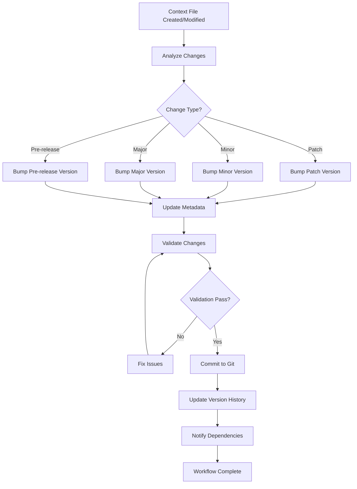

# Context Version Control Workflow

## Overview
This document defines the workflow and procedures for managing context file versions in the memory-bank system. It covers the complete lifecycle from creation to retirement, including version bumping, validation, and rollback procedures.

## Workflow Overview



## Change Analysis Workflow

### Step 1: Change Detection
1. **Monitor file modifications** in `memory-bank/context/` directory
2. **Compare content** with previous version using checksums
3. **Identify change scope** and impact level
4. **Determine version bump type** based on change analysis

### Step 2: Change Classification
- **Patch Changes** (1.0.0 → 1.0.1)
  - Text corrections and formatting
  - Example updates and clarifications
  - Non-functional improvements
  
- **Minor Changes** (1.0.0 → 1.1.0)
  - New features or capabilities
  - Enhanced functionality
  - Additional context sections
  
- **Major Changes** (1.0.0 → 2.0.0)
  - Breaking changes
  - Structural modifications
  - Incompatible updates

### Step 3: Impact Assessment
- **Dependency Analysis**: Check which files reference this context
- **Breaking Change Detection**: Identify incompatible modifications
- **Rollback Complexity**: Assess difficulty of reverting changes
- **Performance Impact**: Evaluate system performance implications

## Version Bumping Workflow

### Automated Version Bumping
```bash
# Patch version bump
context-version bump --type patch --file entrypoint.md

# Minor version bump
context-version bump --type minor --file entrypoint.md

# Major version bump
context-version bump --type major --file entrypoint.md

# Pre-release version bump
context-version bump --type pre-release --file entrypoint.md
```

### Manual Version Bumping
1. **Edit file frontmatter** to update version number
2. **Update change_log** with descriptive change summary
3. **Set version_type** to match version increment
4. **Update last_updated** timestamp
5. **Recalculate checksum** for new content
6. **Validate metadata** for consistency

### Version Bump Rules
- **Patch**: Increment PATCH number (1.0.0 → 1.0.1)
- **Minor**: Increment MINOR number, reset PATCH (1.0.0 → 1.1.0)
- **Major**: Increment MAJOR number, reset MINOR and PATCH (1.0.0 → 2.0.0)
- **Pre-release**: Add pre-release identifier (1.0.0 → 1.0.0-alpha.1)

## Validation Workflow

### Step 1: Metadata Validation
1. **Required Fields Check**: Ensure all required fields are present
2. **Format Validation**: Verify version format and timestamp format
3. **Checksum Verification**: Validate content checksum
4. **Dependency Validation**: Check referenced dependencies exist

### Step 2: Content Validation
1. **Markdown Syntax**: Validate markdown formatting
2. **Link Validation**: Check internal and external links
3. **Structure Validation**: Verify file organization
4. **Consistency Check**: Ensure alignment with other context files

### Step 3: System Validation
1. **Dependency Resolution**: Verify dependency chain integrity
2. **Breaking Change Impact**: Assess impact on dependent files
3. **Performance Impact**: Evaluate system performance implications
4. **Security Validation**: Check for security vulnerabilities

## Rollback Workflow

### Step 1: Rollback Planning
1. **Identify Target Version**: Determine which version to restore
2. **Impact Assessment**: Analyze impact on dependent files
3. **Dependency Resolution**: Plan dependency rollback sequence
4. **Validation Strategy**: Plan validation approach for rollback

### Step 2: Rollback Execution
```bash
# Rollback to specific version
context-version rollback --file entrypoint.md --version 1.0.0

# Rollback with dependency handling
context-version rollback --file entrypoint.md --version 1.0.0 --handle-dependencies

# Rollback with validation
context-version rollback --file entrypoint.md --version 1.0.0 --validate
```

### Step 3: Post-Rollback Validation
1. **Content Verification**: Ensure correct version is restored
2. **Dependency Check**: Verify dependent files are compatible
3. **System Validation**: Test system functionality
4. **Documentation Update**: Update rollback records

## Git Integration Workflow

### Step 1: Pre-Commit Validation
1. **Version Metadata Check**: Validate frontmatter consistency
2. **Checksum Verification**: Ensure content matches checksum
3. **Dependency Validation**: Check dependency integrity
4. **Breaking Change Review**: Review breaking change implications

### Step 2: Commit Process
```bash
# Stage versioned context files
git add memory-bank/context/

# Create commit with version information
git commit -m "feat(context): bump entrypoint.md to v1.1.0

- Added new context categories for product specifications
- Enhanced navigation structure
- No breaking changes"
```

### Step 3: Post-Commit Actions
1. **Version History Update**: Update version history directory
2. **Dependency Notification**: Notify dependent files of changes
3. **Change Log Update**: Update system change log
4. **Validation Trigger**: Run post-commit validation

## Dependency Management Workflow

### Step 1: Dependency Tracking
1. **Identify Dependencies**: Map file relationships
2. **Version Compatibility**: Track compatible version ranges
3. **Breaking Change Propagation**: Plan breaking change handling
4. **Dependency Graph**: Maintain dependency visualization

### Step 2: Dependency Resolution
1. **Version Conflict Detection**: Identify incompatible versions
2. **Resolution Strategy**: Plan conflict resolution approach
3. **Update Coordination**: Coordinate updates across dependencies
4. **Validation**: Verify dependency integrity after updates

### Step 3: Dependency Monitoring
1. **Change Detection**: Monitor dependent file changes
2. **Impact Assessment**: Assess impact of dependency changes
3. **Update Planning**: Plan necessary updates
4. **Validation**: Verify system integrity after updates

## Quality Assurance Workflow

### Step 1: Automated Testing
1. **Unit Tests**: Test individual version control functions
2. **Integration Tests**: Test version control system integration
3. **Validation Tests**: Test validation and consistency checks
4. **Performance Tests**: Test system performance impact

### Step 2: Manual Review
1. **Code Review**: Review implementation changes
2. **Documentation Review**: Review workflow documentation
3. **User Acceptance Testing**: Test with end users
4. **Security Review**: Review security implications

### Step 3: Deployment Validation
1. **Staging Environment**: Test in staging environment
2. **Production Validation**: Validate in production environment
3. **Rollback Testing**: Test rollback procedures
4. **Performance Monitoring**: Monitor system performance

## Error Handling Workflow

### Step 1: Error Detection
1. **Validation Failures**: Detect validation errors
2. **System Errors**: Detect system-level errors
3. **User Errors**: Detect user input errors
4. **Integration Errors**: Detect integration failures

### Step 2: Error Classification
1. **Severity Assessment**: Classify error severity
2. **Impact Analysis**: Analyze error impact
3. **Root Cause Analysis**: Identify error root causes
4. **Resolution Planning**: Plan error resolution

### Step 3: Error Resolution
1. **Immediate Response**: Provide immediate error feedback
2. **Resolution Implementation**: Implement error fixes
3. **Validation**: Verify error resolution
4. **Documentation**: Document error and resolution

## Monitoring and Reporting

### Step 1: System Monitoring
1. **Version Change Tracking**: Monitor version changes
2. **Dependency Monitoring**: Monitor dependency relationships
3. **Performance Monitoring**: Monitor system performance
4. **Error Monitoring**: Monitor error occurrences

### Step 2: Reporting
1. **Change Reports**: Generate change summary reports
2. **Dependency Reports**: Generate dependency analysis reports
3. **Performance Reports**: Generate performance impact reports
4. **Error Reports**: Generate error summary reports

### Step 3: Continuous Improvement
1. **Process Analysis**: Analyze workflow effectiveness
2. **Performance Optimization**: Optimize system performance
3. **User Feedback**: Collect and analyze user feedback
4. **Workflow Updates**: Update workflows based on analysis

## Best Practices

### Version Management
- **Always use semantic versioning** for consistent version numbering
- **Update change logs** with clear, descriptive change summaries
- **Validate metadata** before committing changes
- **Test rollback procedures** regularly

### Dependency Management
- **Minimize dependencies** to reduce complexity
- **Document dependencies** clearly and completely
- **Test dependency updates** thoroughly
- **Plan breaking changes** carefully

### Quality Assurance
- **Automate testing** where possible
- **Validate changes** at multiple levels
- **Monitor system performance** continuously
- **Document procedures** clearly and completely

### User Experience
- **Provide clear error messages** for validation failures
- **Offer helpful guidance** for common issues
- **Maintain backward compatibility** when possible
- **Provide rollback options** for problematic changes
